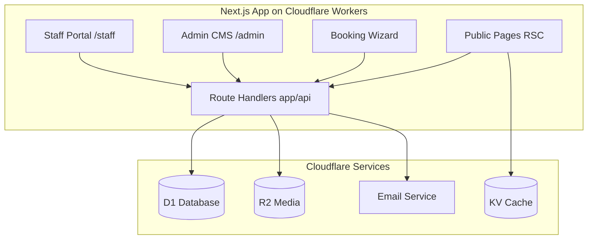
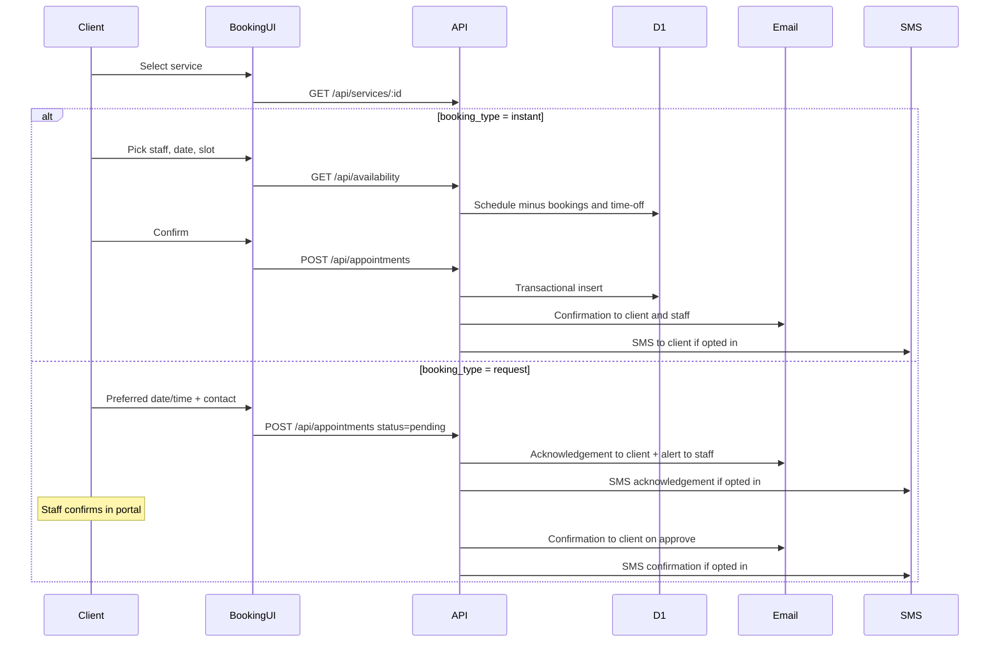

# Family Salon & Spa — Master Plan (Unified)

**Client:** Family Hair Salon & Wellness Spa  
**Domain:** [familysalonspa.com](https://familysalonspa.com/)  
**Status:** Approved for implementation pending client sign-off  
**Last updated:** July 22, 2026

---

## 1. Client Audit

| Attribute | Details |
|-----------|---------|
| **Business Name** | Family Hair Salon & Wellness Spa |
| **Address** | 34777 Grand River Ave, Farmington, MI 48335 |
| **Phone** | (248) 474-6520 / (248) 635-5127 |
| **Current Platform** | GoDaddy Website Builder (broken appointment system) |
| **Current Registrar** | GoDaddy |
| **Target Infrastructure** | Cloudflare Workers + D1 + R2 + Email Service + Registrar |
| **Expected Volume** | < 1,000 appointments/month (~30–50 daily, ~5 MB/year DB growth) |

### Service Menu

- **Hair Care:** Styling, coloring, extensions, perm waving, straightening, rebonding
- **Skin Care:** Dermatological facials, face mapping skin analysis
- **Nail Care:** Manicures, pedicures, shellac, polish changes
- **Wellness:** Grooming, body wax, massage, wellness treatments
- **Special:** Private women's area (hijab-friendly services)

### Confirmed Scope

- Hybrid booking: instant slots for some services, request-to-confirm for others
- No online payments (gift certificates in-person/phone only)
- Client edits content herself via admin console
- Luxurious WordPress-like design; no glassmorphism; no floating card grids

---

## 2. Technology Stack

| Layer | Choice | Rationale |
|-------|--------|-----------|
| **Framework** | Next.js 15 App Router | Best DX for marketing + admin + staff in one codebase |
| **Cloudflare deploy** | `@opennextjs/cloudflare` | Official recommended adapter ([docs](https://developers.cloudflare.com/workers/framework-guides/web-apps/nextjs/)) |
| **Database** | Cloudflare D1 | Relational data for CMS, users, appointments |
| **Media** | Cloudflare R2 | Image uploads; D1 stores metadata only |
| **Email** | Cloudflare Email Service | Booking confirmations, staff alerts (primary channel, no per-message cost) |
| **SMS** | Twilio via Worker subrequest (optional) | Phone confirmations when enabled; ~$50–75/mo at 5k msgs (not free) |
| **Styling** | Tailwind CSS 4 + CSS variables | Palette switching, responsive design |
| **Validation** | Zod | Shared schemas for API + forms |
| **Rich text** | TipTap | CMS block editor |
| **Auth** | Custom sessions in D1 | HTTP-only cookies; tiered login (see §7) |



### Why Not Astro

Astro's islands model splits the mental model across a static site + separate API worker. This project is ~40% interactive (CMS, booking, staff portal). Next.js provides a single React codebase with Server Components for SEO pages and Client Components for dashboards — fewer integration headaches, larger ecosystem, and Cloudflare's preferred deployment path.

---

## 3. Design System

### Design Quality Bar (client will compare side-by-side)

The client will evaluate our design against [familysalonspa.com](https://familysalonspa.com/). Our site must feel **world-class, editorial, and unmistakably human** - not a template, not AI-generated, not "another salon website."

**Benchmark references** (layout and tone, not copy):
- Luxury editorial salon sites: generous whitespace, strong photography, restrained typography
- High-end spa brochures: calm confidence, not hype
- Local trust signals: real address, real phone numbers, real private-area story

**What "world-class" means in practice:**

| Area | Do | Avoid (AI slop) |
|------|-----|-----------------|
| **Photography** | Warm, editorial salon imagery; real or carefully curated shots that feel local | Generic smiling stock models, over-saturated "wellness" photos, obvious AI-generated faces |
| **Layout** | Intentional asymmetry, full-bleed heroes, editorial rhythm | Symmetric 3-column icon grids, identical repeated blocks, dashboard-style card walls |
| **Typography** | Confident serif headlines, readable body, clear hierarchy | All-caps buzzword headers, excessive letter-spacing, gradient text |
| **Color** | Restrained palette, gold used as accent not flood | Rainbow gradients, neon accents, purple-on-white "startup" look |
| **Motion** | Subtle fade-in on scroll, smooth page transitions | Bouncing buttons, parallax overload, particle effects |
| **Copy** | Specific, warm, local, factual | "Elevate your journey", "nestled in", "look no further", "transformative experience", empty superlatives |
| **CTAs** | "Book an appointment", "Call (248) 474-6520" | "Unlock your best self", "Start your wellness journey today" |

**Phase 1 design deliverable:** Mood board + 2-3 homepage wireframe directions before full build. Client picks direction before we code.

### Mandate

- **No glassmorphism** — zero blur, zero transparency overlays
- **No floating card grids** — use editorial sections, bordered panels, generous whitespace
- **Solid panels OK** — opaque `#FFFFFF` on `#FAF8F5` with 1px `#E8E2D9` borders where content grouping is needed (e.g., booking step panel)

### Typography

- **Headings:** Playfair Display or Cormorant Garamond
- **Body:** Plus Jakarta Sans or Inter
- High contrast, generous line-height (1.6–1.75 body)

### Color Palettes — 4 Themes (admin-switchable)

The site ships with **4 color themes**. The owner can preview and switch between them in Admin → Settings → Appearance. Only one theme is active at a time.

| # | Theme name | Origin | Default? |
|---|------------|--------|----------|
| 0 | **Farmington Rose Gold & Alabaster** | Inspired by [familysalonspa.com](https://familysalonspa.com/) warm gold/cream GoDaddy identity | **Yes** |
| 1 | **Warm Earth Spa** | Alternative — sage and sand, organic/wellness feel | No |
| 2 | **Noir Salon Luxe** | Alternative — charcoal + champagne, high-fashion editorial | No |
| 3 | **Terracotta & Cashmere** | Alternative — terracotta + cashmere, modern feminine boutique | No |

#### Were colors sourced from the existing website?

**Partially — not yet pixel-extracted.** Palette 0 was designed to match the *feel* of the current [familysalonspa.com](https://familysalonspa.com/) site: warm ivory backgrounds, rose-gold accents, and dark brown headings typical of its GoDaddy template. The hex values below are a **brand-informed starting point**, not a direct CSS scrape.

**Phase 1 task (before build):** Extract actual hex values from the live site's CSS, logo, and hero imagery; calibrate Palette 0 to match. Client said she likes the existing palette but is open to alternatives — so Palette 0 stays closest to current brand, and themes 1–3 give her options to preview without a redesign.

**Default — Farmington Rose Gold & Alabaster:**

```json
{
  "palette_name": "Farmington Rose Gold & Alabaster",
  "is_default": true,
  "colors": {
    "bg_main": "#FAF8F5",
    "bg_panel": "#FFFFFF",
    "border_subtle": "#E8E2D9",
    "text_heading": "#1C1917",
    "text_body": "#44403C",
    "accent_primary": "#B88E4C",
    "accent_hover": "#9A7336",
    "accent_subtle": "#F4ECE1"
  }
}
```

Additional palettes (client can preview in admin — themes 1–3):
- **Warm Earth Spa** — sage and sand, organic feel
- **Noir Salon Luxe** — charcoal + champagne, high-fashion
- **Terracotta & Cashmere** — modern feminine boutique

Palette stored in `site_settings`; applied via CSS custom properties at runtime.

### Content and Copy Standards

All public-facing copy (pages, booking flow, emails, SMS) must read like a real salon owner wrote it - not a marketing bot.

#### Punctuation rule (strict)

- **Never use em dashes (—)** anywhere on the site, in emails, or in SMS.
- Use regular hyphens (-) only. Use commas, periods, or parentheses instead of em-dash pauses.
- Enforce in code review and seed content. Add a lint/check script that flags `—` and `\u2014` in CMS seed files and templates.

#### Voice and tone

- **Warm, direct, local.** Write for Farmington, MI clients who already know the salon or find it by referral.
- **Short sentences.** One idea per sentence. Break up long blocks.
- **Specific over vague.** "Dermatological facials customized with face mapping" beats "revolutionary skin treatments."
- **Use real facts from the current site:** Grand River Ave address, both phone numbers, private area for hijab-friendly services, hair/skin/nail/wellness menu.
- **Second person sparingly.** "We welcome you" is fine. "You deserve to feel pampered" is not.

#### Content sources (humanized, not generated from scratch)

1. **Start from existing site copy** on [familysalonspa.com](https://familysalonspa.com/) - preserve facts, rewrite for clarity and flow.
2. **Owner review pass** before launch - she approves every page in admin preview.
3. **No lorem ipsum** in staging or demo. Use real placeholder copy based on actual services.
4. **Service descriptions:** Name the service, duration, what to expect, who it's for. No filler paragraphs.

#### Example rewrite (homepage hero)

**Avoid (AI slop):**
> Welcome to a transformative wellness journey nestled in the heart of Farmington - where luxury meets relaxation and every visit elevates your self-care experience.

**Use (humanized):**
> Family Hair Salon and Wellness Spa has served Farmington for years. Walk in for a cut, color, facial, or manicure - or book time in our private suite if you prefer a quieter setting.

#### Anti-slop checklist (review before launch)

- [ ] No em dashes anywhere in copy
- [ ] No words: "elevate", "curated", "nestled", "journey", "transformative", "unlock", "discover your"
- [ ] Every service page names at least 3 real services from the menu
- [ ] Contact page shows both phone numbers and full address
- [ ] Private area page uses respectful, factual language (not tokenism)
- [ ] Photos have alt text describing what's actually in the image
- [ ] Owner has signed off on all page copy in preview mode

### Layout Patterns

- Full-bleed hero with solid gradient overlay (opaque, not glass)
- Alternating image/text editorial rows
- Service lists as bordered sections with dividers
- Gallery: masonry or uniform grid with thin gutters (not card shadows)
- Sticky mobile CTA: "Book Appointment" + tap-to-call

### Tailwind Tokens

```javascript
// tailwind.config.ts
colors: {
  salon: {
    bg: "var(--salon-bg-main)",
    panel: "var(--salon-bg-panel)",
    border: "var(--salon-border)",
    heading: "var(--salon-text-heading)",
    body: "var(--salon-text-body)",
    primary: "var(--salon-accent)",
    hover: "var(--salon-accent-hover)",
    light: "var(--salon-accent-subtle)",
  }
}
```

---

## 4. Site Map

| Route | Type | Description |
|-------|------|-------------|
| `/` | Public | Home — hero, services, private area callout, CTA |
| `/hair-care` | Public CMS | Hair services |
| `/skin-care` | Public CMS | Skin services |
| `/nail-care` | Public CMS | Nail services |
| `/wellness` | Public CMS | Massage, wax, grooming |
| `/products` | Public CMS | Product showcase |
| `/gift-certificates` | Public | Info + phone CTA |
| `/gallery` | Public CMS | Photo albums from R2 |
| `/about` | Public CMS | Story, team bios |
| `/contact` | Public CMS | Address, map, hours, phones |
| `/private-area` | Public CMS | Hijab-friendly private services |
| `/appointments` | Public | Hybrid booking wizard |
| `/admin` | Protected | Owner/manager CMS + analytics |
| `/staff` | Protected | Stylist daily schedule |

---

## 5. Database Schema (D1)

File: `migrations/0001_initial.sql`

```sql
-- Auth
CREATE TABLE users (
  id INTEGER PRIMARY KEY AUTOINCREMENT,
  email TEXT UNIQUE,
  password_hash TEXT,
  pin_hash TEXT,           -- optional quick login for staff
  role TEXT NOT NULL,      -- owner, manager, stylist, receptionist
  name TEXT NOT NULL,
  is_active INTEGER DEFAULT 1,
  created_at TEXT DEFAULT (datetime('now'))
);

CREATE TABLE sessions (
  id TEXT PRIMARY KEY,
  user_id INTEGER NOT NULL REFERENCES users(id),
  expires_at TEXT NOT NULL
);

-- CMS
CREATE TABLE pages (
  id INTEGER PRIMARY KEY AUTOINCREMENT,
  slug TEXT UNIQUE NOT NULL,
  title TEXT NOT NULL,
  seo_title TEXT,
  seo_description TEXT,
  status TEXT DEFAULT 'draft',  -- draft, published
  updated_at TEXT DEFAULT (datetime('now'))
);

CREATE TABLE page_blocks (
  id INTEGER PRIMARY KEY AUTOINCREMENT,
  page_id INTEGER NOT NULL REFERENCES pages(id) ON DELETE CASCADE,
  sort_order INTEGER NOT NULL,
  block_type TEXT NOT NULL,     -- hero, text, image, service_list, cta, gallery
  content_json TEXT NOT NULL
);

CREATE TABLE site_settings (
  key TEXT PRIMARY KEY,
  value_json TEXT NOT NULL
);

CREATE TABLE media_assets (
  id INTEGER PRIMARY KEY AUTOINCREMENT,
  r2_key TEXT NOT NULL,
  filename TEXT NOT NULL,
  alt_text TEXT,
  mime_type TEXT,
  size_bytes INTEGER,
  uploaded_by INTEGER REFERENCES users(id),
  created_at TEXT DEFAULT (datetime('now'))
);

-- Services & Staff
CREATE TABLE services (
  id INTEGER PRIMARY KEY AUTOINCREMENT,
  name TEXT NOT NULL,
  category TEXT NOT NULL,       -- hair, skin, nails, wellness
  description TEXT,
  duration_minutes INTEGER NOT NULL,
  price REAL,                   -- display only, no checkout
  booking_type TEXT NOT NULL,   -- instant, request
  is_active INTEGER DEFAULT 1
);

CREATE TABLE staff_profiles (
  id INTEGER PRIMARY KEY AUTOINCREMENT,
  user_id INTEGER NOT NULL REFERENCES users(id),
  display_name TEXT NOT NULL,
  bio TEXT,
  photo_url TEXT,
  is_bookable INTEGER DEFAULT 1
);

CREATE TABLE staff_services (
  staff_id INTEGER NOT NULL REFERENCES staff_profiles(id),
  service_id INTEGER NOT NULL REFERENCES services(id),
  PRIMARY KEY (staff_id, service_id)
);

CREATE TABLE staff_availability (
  id INTEGER PRIMARY KEY AUTOINCREMENT,
  staff_id INTEGER NOT NULL REFERENCES staff_profiles(id),
  day_of_week INTEGER NOT NULL,  -- 0=Sun, 6=Sat
  start_time TEXT NOT NULL,        -- HH:MM
  end_time TEXT NOT NULL
);

CREATE TABLE staff_time_off (
  id INTEGER PRIMARY KEY AUTOINCREMENT,
  staff_id INTEGER REFERENCES staff_profiles(id),  -- NULL = salon-wide
  start_datetime TEXT NOT NULL,
  end_datetime TEXT NOT NULL,
  reason TEXT
);

CREATE TABLE salon_holidays (
  id INTEGER PRIMARY KEY AUTOINCREMENT,
  date TEXT NOT NULL,              -- YYYY-MM-DD
  label TEXT,
  is_closed INTEGER DEFAULT 1
);

-- Appointments
CREATE TABLE appointments (
  id INTEGER PRIMARY KEY AUTOINCREMENT,
  service_id INTEGER NOT NULL REFERENCES services(id),
  staff_id INTEGER REFERENCES staff_profiles(id),
  client_name TEXT NOT NULL,
  client_email TEXT,
  client_phone TEXT NOT NULL,
  start_datetime TEXT NOT NULL,
  end_datetime TEXT NOT NULL,
  status TEXT DEFAULT 'pending',   -- pending, confirmed, in_progress, completed, cancelled, no_show
  booking_source TEXT NOT NULL,    -- instant, request
  notes TEXT,
  sms_opt_in INTEGER DEFAULT 0,
  sms_opt_in_at TEXT,
  created_at TEXT DEFAULT (datetime('now'))
);

CREATE INDEX idx_appointments_staff_date ON appointments(staff_id, start_datetime);
CREATE INDEX idx_appointments_status ON appointments(status);
CREATE INDEX idx_page_blocks_page ON page_blocks(page_id, sort_order);
CREATE INDEX idx_services_category ON services(category);
```

---

## 6. Appointment System (Hybrid)

### Scheduling approach: custom-built, no external calendars

**We are NOT using external calendar services** (Google Calendar, Outlook, Cal.com, Acuity, Square Appointments, etc.). The entire scheduling stack is built in-house on Cloudflare:

| Layer | What we use |
|-------|-------------|
| **Data store** | Cloudflare D1 (`appointments`, `staff_availability`, `staff_time_off`, `salon_holidays`) |
| **Availability engine** | Custom `lib/availability.ts` - calculates open slots from staff hours minus bookings and blocks |
| **Public booking UI** | Custom hybrid wizard at `/appointments` (instant slots + request form) |
| **Admin schedule view** | Custom calendar UI in `/admin` (week/day grid, built with a React calendar component) |
| **Staff schedule view** | Custom mobile list/timeline at `/staff` (not a third-party widget) |
| **Notifications** | Cloudflare Email Service (+ optional Twilio SMS) |

**Why custom, not external:**
- Keeps everything on Cloudflare free tier (no Acuity/Cal.com monthly fees)
- Full control over hybrid booking (instant vs request per service)
- PIN staff portal reads same D1 data - no sync issues
- Client owns all appointment data in D1

**Not in scope (unless added later):**
- Google Calendar / Outlook two-way sync
- iCal feed export for staff personal calendars
- Import from GoDaddy's old booking system

**Optional Phase 2+ add-on (if client requests):** Read-only iCal export URL per staff member so stylists can subscribe in their phone's Calendar app. No two-way sync in v1.

---


### Customer Notifications (Email + SMS)

**Email** is the primary channel (free via Cloudflare Email Service). **SMS** is an optional secondary channel for customers who opt in at booking.

#### Cloudflare free-tier reality for SMS

Cloudflare has **no native SMS/phone notification service** (unlike Email Service). SMS requires an external provider called from a Worker via `fetch()` — the Worker call itself is free-tier eligible ([Cloudflare Twilio tutorial](https://developers.cloudflare.com/workers/tutorials/github-sms-notifications-using-twilio/)), but **each SMS message is paid** (~$0.01/msg all-in for US numbers via Twilio).

| Channel | Free on Cloudflare? | Est. monthly cost (this client) |
|---------|--------------------|---------------------------------|
| Email | Yes (Email Service on domain) | $0 |
| SMS (5,000 msgs) | No — external provider | ~$50–75/mo (Twilio pay-as-you-go) |
| Twilio trial | 100 SMS total (dev/testing only) | $0 for first 100 msgs |

**Recommendation:** Ship with **email always on**. Add **SMS as an admin-toggleable feature** — owner enables it when comfortable with ~$50–75/month operating cost. At <100 regular clients and ≤5,000 SMS/month, this is affordable but not free.

#### Notification triggers

| Trigger | Email | SMS (if opted in) |
|---------|-------|-------------------|
| **Instant booking confirmed** | Yes | Yes |
| **Request submitted** (pending) | Yes — acknowledgement | Yes — "Request received" |
| **Staff confirms pending request** | Yes — confirmation | Yes — confirmation |
| **Staff rejects pending request** | Yes — decline + phone | Yes — short decline + phone |
| **Rescheduled** | Yes | Yes |
| **Cancelled** | Yes | Yes |
| **24-hour reminder** (Phase 4) | Yes | Yes |

Staff alerts remain **email-only** (no staff SMS) to control cost.

#### SMS implementation

- **Provider:** Twilio REST API from `lib/sms.ts` (official Cloudflare Workers pattern)
- **Secrets:** `TWILIO_ACCOUNT_SID`, `TWILIO_AUTH_TOKEN`, `TWILIO_FROM_NUMBER` in Wrangler secrets
- **Compliance:** TCPA opt-in checkbox at booking ("Text me appointment updates"); store `sms_opt_in` + `sms_opt_in_at` on appointment
- **Admin controls** (Settings → Notifications):
  - Master toggle: SMS enabled/disabled — **ships OFF by default; owner activates later** when ready to set up Twilio + budget
  - Monthly SMS cap (default 5,000) — auto-fallback to email-only when cap reached
  - Usage counter dashboard (msgs sent this month)
- **Fallback chain:** SMS fails → log error → email still sent → on-screen confirmation always shown
- **10DLC registration:** Required for US business SMS (~$4.50 one-time brand fee + ~$2–10/mo campaign fee); budget into launch checklist

#### When customer has no email

If only phone is provided and SMS is enabled + opted in → SMS is primary. If SMS disabled → on-screen confirmation + staff follow up by phone manually.

Emails sent from `appointments@familysalonspa.com`. SMS sent from salon's Twilio number (e.g. `(248) xxx-xxxx`).

### Availability Rules

- 15-minute slot granularity
- 15-minute buffer between appointments (admin-configurable)
- Weekly recurring hours per staff + salon holidays + individual time-off
- Double-booking prevented via `BEGIN IMMEDIATE` transaction on insert

### Staff Actions

- Confirm / reject pending requests
- Mark: in-progress, completed, no-show
- Reschedule or cancel
- View own schedule or full salon schedule (role-dependent)

---

## 7. Authentication

| Role | Login method | Access |
|------|-------------|--------|
| **Owner** | Email + password | Full admin: CMS, services, staff, analytics, settings |
| **Manager** | Email + password | Admin minus owner-only settings (billing, role changes) |
| **Stylist / Receptionist** | 4–6 digit PIN or magic link | Staff portal only: schedule, appointment status |
| **Public** | None | Booking, browsing |

- Sessions: random token, `HttpOnly; Secure; SameSite=Lax`, 7-day expiry
- Passwords: bcrypt; PINs: bcrypt hashed
- Rate limiting on `/api/auth/*` and `/api/appointments`
- CSRF tokens on admin mutations

---

## 8. Admin Console (`/admin`)

| Section | Features |
|---------|----------|
| **Dashboard** | Today's bookings, pending requests, weekly/monthly stats |
| **Pages** | Block editor (TipTap + structured blocks), draft/publish |
| **Services** | CRUD, pricing, duration, booking type, category |
| **Staff** | Profiles, roles, availability, service assignments |
| **Appointments** | Calendar view, confirm/reject/reschedule |
| **Media** | Upload to R2, alt text, gallery management |
| **Settings** | Hours, phones, address, palette picker, holidays, SEO, **SMS toggle + cap** |
| **Analytics** | Bookings by day/week/month, no-show rate, popular services |

---

## 9. Staff Portal (`/staff`)

Lightweight, mobile-first portal for stylists and receptionists on the salon floor. Separate from `/admin` - no CMS, no analytics, no clutter.

### PIN login screen (`/staff/login`)

Dedicated mobile login - not the admin email/password form.

| Element | Spec |
|---------|------|
| **Route** | `/staff/login` (unauthenticated); redirects to `/staff` after success |
| **Input** | 4-6 digit numeric PIN pad (large touch targets, 48px min) |
| **Staff picker** | Optional: tap name/avatar first, then enter PIN (for shared front-desk tablet) |
| **Session** | 8-hour cookie on salon devices; "Log out" in header |
| **Fallback** | Magic link via SMS/email for staff who forget PIN (owner resets PIN in admin) |
| **Security** | bcrypt-hashed PIN in D1; rate limit 5 failed attempts per 15 min |
| **Design** | Minimal - salon logo, "Staff Schedule", PIN pad, no marketing chrome |

```
┌─────────────────────────┐
│   [Salon Logo]          │
│   Staff Schedule        │
│                         │
│   ○ Sarah  ○ Maria      │  ← staff picker (optional)
│                         │
│   ┌───┬───┬───┐         │
│   │ 1 │ 2 │ 3 │         │
│   ├───┼───┼───┤         │
│   │ 4 │ 5 │ 6 │         │  ← numeric PIN pad
│   ├───┼───┼───┤         │
│   │ 7 │ 8 │ 9 │         │
│   ├───┼───┼───┤         │
│   │   │ 0 │ ⌫ │         │
│   └───┴───┴───┘         │
│                         │
│   [ Enter ]             │
└─────────────────────────┘
```

### Schedule view (post-login)

Mobile-first, thumb-friendly, loads in under 1 second on 4G.

| View | What it shows |
|------|---------------|
| **Today (default)** | Chronological list of today's appointments: time, client name, service, status badge |
| **Timeline toggle** | Switch to vertical timeline view (hour blocks) |
| **This week** | Swipeable 7-day strip; tap a day to see that day's list |
| **Pending queue** | Badge count on tab; one-tap confirm/reject for request-based bookings |
| **Appointment detail** | Tap row to expand: phone (tap-to-call), notes, status actions |
| **Status actions** | Large buttons: Confirm, Start, Complete, No-Show, Cancel |
| **Filter** | "My schedule" (default for stylists) or "Full salon" (receptionist/owner) |

**Not included in staff portal** (admin only): CMS, service editing, analytics, staff management, palette settings.

### Staff portal routes

| Route | Purpose |
|-------|---------|
| `/staff/login` | PIN authentication screen |
| `/staff` | Today's schedule (default landing) |
| `/staff/week` | Week view |
| `/staff/pending` | Pending request queue |
| `/staff/availability` | Personal hours editor |

---

## 10. Project Structure

```
familysalonspa/
├── src/
│   ├── app/
│   │   ├── (public)/           # Marketing pages
│   │   │   ├── page.tsx
│   │   │   ├── hair-care/
│   │   │   ├── appointments/
│   │   │   └── ...
│   │   ├── admin/              # CMS dashboard
│   │   ├── staff/              # Staff portal
│   │   └── api/                # Route Handlers
│   │       ├── auth/
│   │       ├── appointments/
│   │       ├── cms/
│   │       ├── media/
│   │       └── services/
│   ├── components/
│   │   ├── layout/             # Header, footer, nav
│   │   ├── sections/           # Editorial section components
│   │   ├── booking/            # Booking wizard
│   │   ├── admin/              # CMS components
│   │   └── staff/              # Staff components
│   ├── lib/
│   │   ├── db.ts               # D1 helpers
│   │   ├── auth.ts             # Session management
│   │   ├── availability.ts     # Slot engine
│   │   ├── email.ts            # Email templates
│   │   ├── sms.ts              # Twilio SMS sender (optional)
│   │   └── notifications.ts    # Unified dispatcher (email + SMS)
│   │   └── validation.ts       # Zod schemas
│   └── styles/
│       └── globals.css         # CSS variables per palette
├── migrations/                 # D1 SQL migrations
├── public/
├── wrangler.jsonc              # D1, R2, KV, Email bindings
├── open-next.config.ts
├── next.config.ts
├── tailwind.config.ts
└── package.json
```

---

## 11. Domain & Launch

### Registrar Transfer (GoDaddy → Cloudflare)

1. Add `familysalonspa.com` to Cloudflare (Free plan)
2. Unlock domain in GoDaddy; generate EPP transfer code
3. Initiate transfer in Cloudflare Registrar (~$10.44/year)
4. Approve transfer out in GoDaddy to skip 5-day wait
5. Configure DNS: Workers custom domain for Next.js app
6. Enable Cloudflare Email Sending for `appointments@familysalonspa.com`
7. Set SPF, DKIM, DMARC records

### SEO

- `sitemap.xml` generated from published pages
- `LocalBusiness` JSON-LD on contact/home pages
- Open Graph tags per page
- Lighthouse target: 90+ mobile

---

## 12. Implementation Phases

### Phase 1 - Foundation (Week 1)
- [ ] Extract live site colors from familysalonspa.com CSS and calibrate Palette 0
- [ ] Mood board + homepage wireframe (2-3 directions); client picks before build
- [ ] Humanize seed copy from existing site content (no em dashes, no AI slop)
- [ ] Scaffold with `npm create cloudflare@latest -- --framework=next --platform=workers`
- [ ] D1 migrations + seed data (services, default pages, owner account)
- [ ] Design system: palettes, typography, editorial section components
- [ ] Public pages: Home, Contact, About, service category shells

### Phase 2 — CMS & Admin (Week 2)
- [ ] Auth (email/password + PIN)
- [ ] Admin console: page editor, settings, media upload to R2
- [ ] Wire public pages to published CMS content
- [ ] Palette switcher in admin

### Phase 3 — Appointments (Week 3)
- [ ] Availability engine + hybrid booking wizard
- [ ] Staff portal with schedule views and status toggles
- [ ] Email notifications (always on)
- [ ] SMS notifications via Twilio (optional, admin-toggled; Twilio account + 10DLC setup)
- [ ] Admin analytics dashboard

### Phase 4 - Polish and Launch (Week 4)
- [ ] Anti-slop copy review + em-dash lint pass on all content
- [ ] Owner copy approval on every page (preview sign-off)
- [ ] Gallery, gift certificates, private area, wellness page
- [ ] SEO, performance pass, accessibility audit
- [ ] Domain transfer and DNS cutover
- [ ] Owner onboarding guide (15-min walkthrough)

---

## 13. Cloudflare Free Tier Fit

| Resource | Expected usage | Free tier |
|----------|---------------|-----------|
| Workers | API + SSR | 100k req/day |
| D1 | CMS + appointments | 500 MB, 5M reads/day |
| R2 | 100–500 images | 10 GB storage |
| KV | ISR cache | 100k reads/day |
| Email | Confirmations | Within sending limits |
| SMS (Twilio) | ~5,000 msgs/mo if enabled | ~$50–75/mo (paid, not Cloudflare free) |
| Registrar | 1 domain | ~$10.44/year (only Cloudflare paid item if SMS off) |

---

## 14. Risks & Mitigations

| Risk | Mitigation |
|------|-----------|
| Client expects WordPress admin UX | Sidebar nav, WYSIWYG, Publish button, preview mode |
| Double-booking race condition | D1 `BEGIN IMMEDIATE` transaction |
| SMS cost surprise | Admin toggle off by default; monthly cap; usage dashboard; email always free fallback |
| Email deliverability | SPF/DKIM/DMARC before launch |
| Staff won't adopt portal | PIN login, mobile-first, minimal taps |
| Client compares us to old GoDaddy site | World-class editorial design, mood board approval, humanized copy from real salon facts |
| Copy feels AI-generated | Anti-slop checklist, rewrite from existing site content, owner review pass, no em dashes |

---

## 15. Deliverables

- Production site at `familysalonspa.com`
- Admin console for self-service content updates
- Staff portal with PIN login
- Hybrid appointment booking with email + optional SMS notifications
- D1 database with migrations and seed data
- R2 media library
- World-class editorial design (client-comparable to current site)
- Humanized copy standards (no em dashes, no AI slop)
- Domain on Cloudflare Registrar
- Owner quick-start guide
